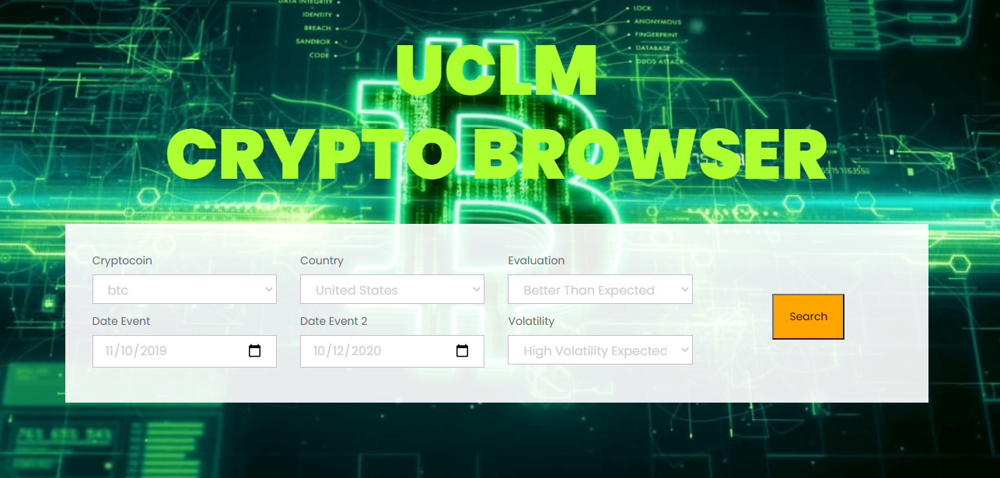
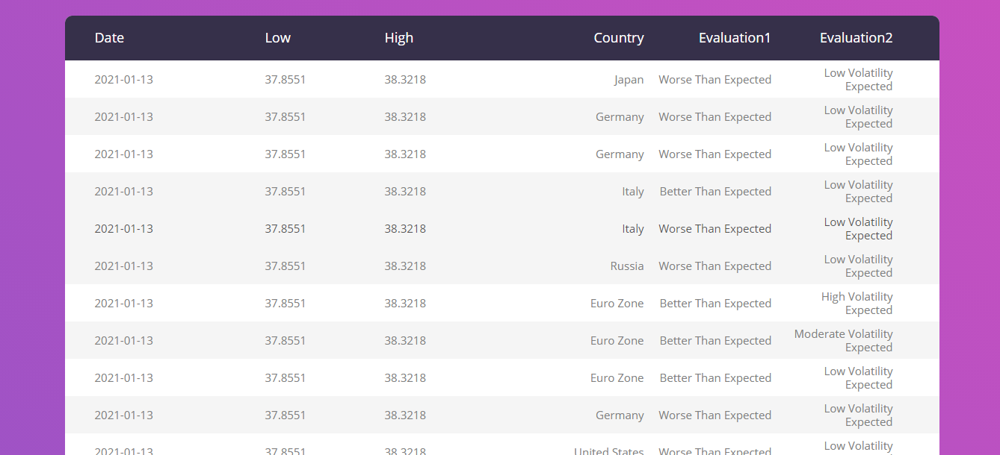

# Integracion
Aplicación "CryptoBrowser" de la clase de Integración

⚙️ Spring 1
  - Memoria
  - Contrato del proyecto
  - Mockup Front end y Back end
  - Archivos .csv con las BBDD
 
 ⚙️ Spring 2
  - Limpieza de los archivos .csv con excel mediante scripts.
  - Creacion BBDD en phpmyadmin con WAMP server.
  - Almacenamiento de los archivos en la BBDD.
  - Diseño inicial de la intervaz web con HTML y CSS.

 ⚙️ Spring 3 - Final
  - Finalización de la interfaz de la página web.
  - Desarrollo de la interación de la página y de las consultas a la BBDD mediante php.
  - Creación de la segunda ventana de la web, en la que mostramos la tabla con los resultados obtenidos. 

Resultado:

